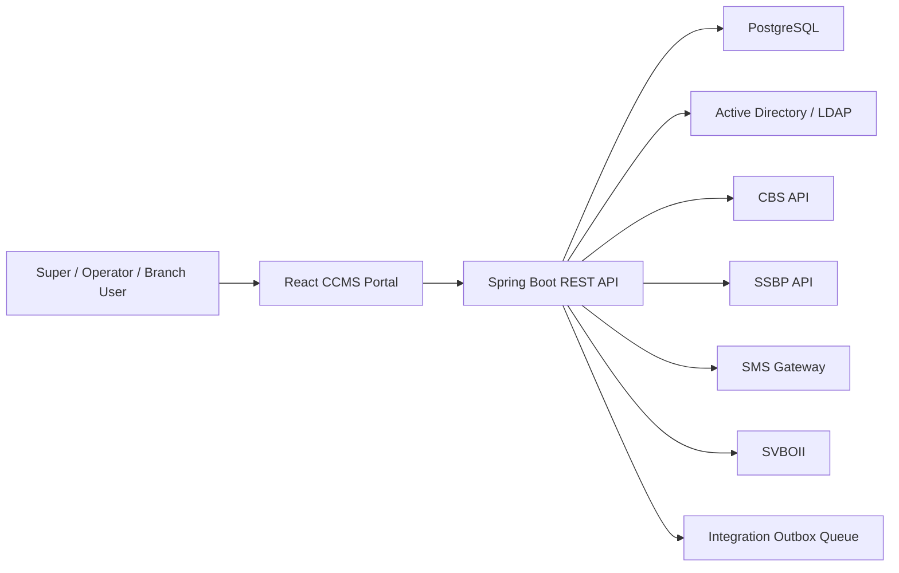
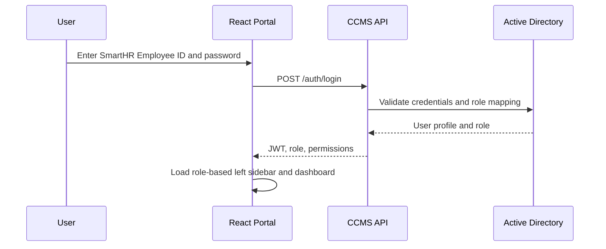
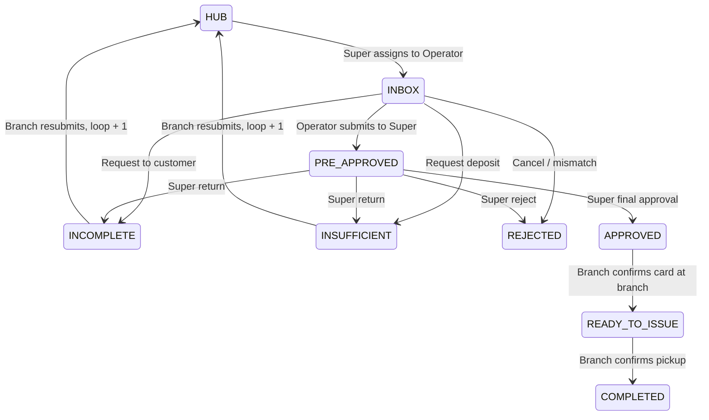

# CCMS Architecture

## System Understanding

CCMS centralizes credit card application intake and processing across SSBP, Branch, KBZPay Centre, and future Smart HR channels. The system controls application workflow from HUB through assignment, operator review, super approval, branch card readiness, customer pickup, notification, SSBP status synchronization, and audit/reporting.

## High-Level Design

## Backend Modules

- `auth`: AD/LDAP login boundary, JWT session, role resolution.
- `application`: branch intake, queue listing, validation, document number generation.
- `workflow`: status transition engine and queue movement rules.
- `audit`: immutable action history.
- `notification`: SMS and SSBP notification log with duplicate protection.
- `reporting`: daily report and user progress report endpoints.
- `integration`: CBS, SSBP, SMS, SVBOII clients and outbox workers.

## Frontend Modules

- `components/layout`: left sidebar, top bar, protected shell.
- `components/data-table`: reusable queue/report table.
- `features/applications`: queue views, workflow actions, branch intake.
- `features/dashboard`: operational dashboard.
- `features/reports`: daily and user progress report screens.
- `stores`: session and role state.
- `lib`: API client and navigation definitions.

## Authentication Flow

## Workflow Engine

## Role And Permission Matrix

| Module | Super | Operator | Branch |
| --- | --- | --- | --- |
| HUB | Assign | No access | No access |
| Inbox | Review / final workflow | Process assigned records | No access |
| Submit | View | View pre-approved submitted records | View own submitted branch records |
| Incomplete / Insufficient | View | View | Resubmit to HUB |
| Rejected | View | View | View |
| Approved | View | View | Mark Ready To Issue |
| Ready To Issue | View | View | Complete pickup |
| Daily Report | All records | All records | Own branch records |
| User Progress Report | All users | All users | Own created and own branch selected records |

## Queue Design

Queues are status-backed views. The API applies status, assignment, role, branch, pagination, sorting, and filtering. Default page size is 15 records. Branch users are filtered by pickup location; operators are filtered by assigned user for Inbox.

## Status Conversion

| CCMS | SSBP Customer Portal |
| --- | --- |
| HUB | Processing |
| INBOX | Processing |
| INCOMPLETE | Incompleted |
| INSUFFICIENT | Insufficient |
| REJECTED | Cancelled |
| PRE_APPROVED | Processing |
| APPROVED | Approved |
| READY_TO_ISSUE | Ready To Pick Up |
| COMPLETED | Completed |

## Notification Design

Workflow actions generate notification log records. SMS is triggered for incomplete, insufficient, rejected, approved, ready to issue, and completed statuses. SSBP MyOrder and SSBP Inbox are synchronized for all customer-visible statuses. A unique key on application, action, and notification type prevents duplicate sending.

